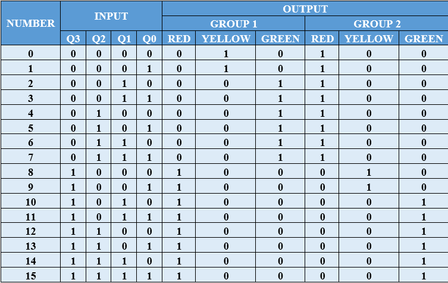
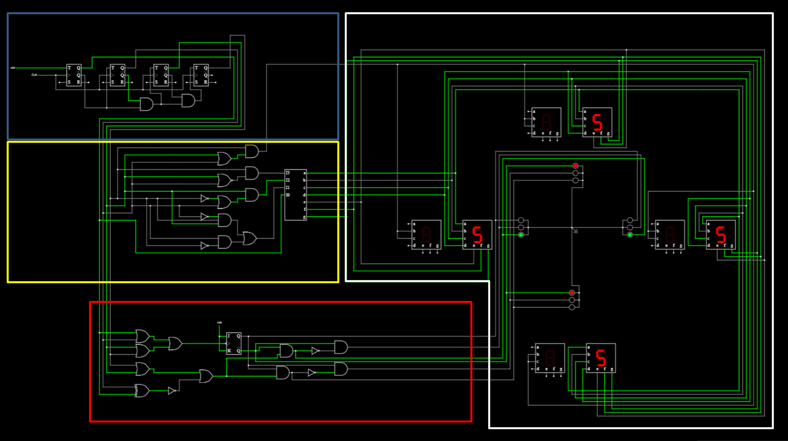
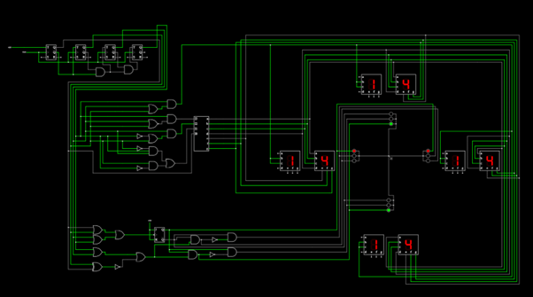
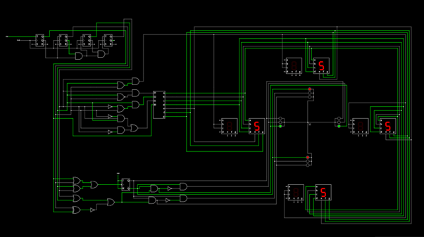

# Traffic Light System Using Logic Gates

## Overview
This project is a digital logic circuit simulation of a traffic light system for a four-way intersection (divided into two main groups). The system is built using fundamental digital components including counters, logic gates, and displays.

## Key Components
- **4-bit Counter:** Drives the timing of the system, cycling through 16 distinct states (0-15).
- **Combinational Logic:** A network of AND, OR, NOT, and XOR gates that decodes the counter state into specific light signals.
- **Traffic Light Indicators:** Red, Yellow, and Green LEDs for two groups of traffic.
- **7-Segment Displays:** Provide a visual representation of the current timing state.

## Logic Design
The system follows a specific sequence to ensure safe traffic flow at the intersection. The transition logic is detailed in the truth table below:

### Truth Table
The 4-bit input (Q3, Q2, Q1, Q0) determines the status of Red, Yellow, and Green lights for both Group 1 and Group 2.

| States | Group 1 | Group 2 |
| :--- | :--- | :--- |
| 0 - 1 | Yellow | Red |
| 2 - 7 | Green | Red |
| 8 - 9 | Red | Yellow |
| 10 - 15 | Red | Green |

## Circuit Diagram
The circuit is organized into functional blocks:
- **Blue Zone:** The synchronous counter.
- **Yellow/Red Zones:** Decoding and control logic.
- **White Zone:** Output display and traffic light simulation.

## Simulation States
Below are screenshots representing different phases of the traffic light cycle:

### Phase A

### Phase B

